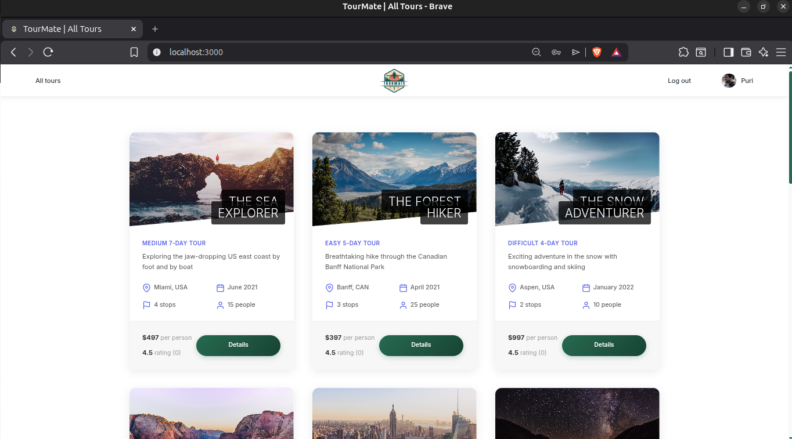
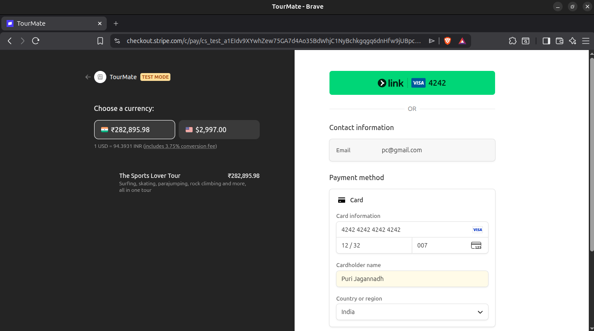

<div align="center">
  <h1>🌿 TourMate</h1>
  <p><strong>A Full-Stack Nature Tour Booking Platform</strong></p>
  <p>Modern web application built with Node.js, Express, MongoDB, and integrated payment processing</p>
  
  
  
  [](https://nodejs.org/)
  [](https://www.mongodb.com/)
</div>

---

## 📋 Table of Contents

- [Overview](#-overview)
- [Key Features](#-key-features)
- [Tech Stack](#-tech-stack)
<!-- - [Demo](#-demo) -->
- [Getting Started](#-getting-started)
- [API Documentation](#-api-documentation)
- [Project Architecture](#-project-architecture)
- [Security Features](#-security-features)
- [What I Learned](#-what-i-learned)
- [Future Enhancements](#-future-enhancements)
- [Contact](#-contact)

---

## 🎯 Overview

TourMate is a comprehensive full-stack web application that enables users to discover, review, and book nature tours. The platform features secure authentication, real-time payment processing via Stripe, interactive maps, and a complete admin dashboard for tour management.

**Project Highlights:**
- 🔐 Secure JWT-based authentication with role-based access control
- 💳 Integrated Stripe payment gateway for seamless transactions
- 🗺️ Interactive tour maps powered by Mapbox GL
- 📧 Automated email notifications for bookings and password resets
- 🛡️ Enterprise-level security with rate limiting, data sanitization, and XSS protection
- 📱 Responsive design for optimal mobile and desktop experience

### 📸 Application Screenshots

<div align="center">
  
  <p><em>Tour Detail Page with Interactive Maps</em></p>
</div>

<div align="center">
  
  <p><em>User Account Dashboard</em></p>
</div>

---

## ✨ Key Features

### 🔐 Authentication & Authorization
- JWT-based secure authentication system
- Password reset via email with token expiration
- Role-based access control (Admin, Lead Guide, Guide, User)
- Secure cookie management with httpOnly flags

### 🎫 Tour Management
- Advanced filtering, sorting, and pagination
- Geospatial queries for tour locations
- Tour statistics and aggregation pipelines
- Image upload and processing with Sharp
- Virtual properties and middleware implementation

### 💳 Booking & Payments
- Stripe integration for secure payment processing
- Webhook handling for payment confirmations
- Booking history and management
- Automated email confirmations

<div align="center">
  
  <p><em>Secure Stripe Payment Integration</em></p>
</div>

### ⭐ Reviews & Ratings
- User reviews with 5-star rating system
- Average rating calculation with MongoDB aggregation
- Nested routes for tour-specific reviews
- Review ownership validation

### 👤 User Features
- Personal dashboard with booking history
- Profile management (photo, name, email)
- Password update functionality
- Account deactivation option

<div align="center">
  
  <p><em>Secure Login Interface</em></p>
</div>

### 🗺️ Interactive Maps
- Mapbox GL integration for tour locations
- Custom markers and popups
- Responsive map rendering

---

<!-- ## 🚀 Demo

**Live Demo:** [View Live Application](https://your-deployed-app-url.com)


### Test Credentials
```
Admin Account:
Email: admin@tourmate.io
Password: password123

User Account:
Email: user@tourmate.io
Password: password123
```

> **Note:** These are demo accounts for testing purposes only.

--- -->

## 🛠 Tech Stack

### Backend
| Technology | Purpose |
|------------|----------|
| **Node.js** | Runtime environment |
| **Express.js** | Web application framework |
| **MongoDB** | NoSQL database |
| **Mongoose** | ODM for MongoDB |
| **JWT** | Authentication & authorization |
| **Stripe API** | Payment processing |

### Frontend
| Technology | Purpose |
|------------|----------|
| **Pug** | Server-side templating engine |
| **JavaScript (ES6+)** | Client-side functionality |
| **CSS3** | Styling and animations |
| **Axios** | HTTP requests |

### Development & Security
| Tool | Purpose |
|------|----------|
| **Nodemailer** | Email delivery |
| **Multer** | File upload handling |
| **Sharp** | Image processing & optimization |
| **Helmet** | Security headers |
| **Express Rate Limit** | API rate limiting |
| **Express Mongo Sanitize** | NoSQL injection prevention |
| **XSS-Clean** | Cross-site scripting protection |
| **HPP** | HTTP parameter pollution prevention |
| **Morgan** | HTTP request logging |
| **Nodemon** | Development auto-restart |

---

## 🚀 Getting Started

### Prerequisites

Ensure you have the following installed:
- **Node.js** (v14.0.0 or higher)
- **MongoDB** (v4.0 or higher)
- **npm** or **yarn**
- **Git**

### Installation

1. **Clone the repository**
   ```bash
   git clone https://github.com/yourusername/tourmate.git
   cd tourmate
   ```

2. **Install dependencies**
   ```bash
   npm install
   ```

3. **Configure environment variables**
   
   Create a `config.env` file in the root directory:
   ```bash
   cp config.env.example config.env
   ```
   
   Update the file with your credentials (see [Environment Variables](#-environment-variables))

4. **Import sample data (Optional)**
   ```bash
   npm run import-data
   ```

5. **Start the development server**
   ```bash
   npm run dev
   ```

6. **Access the application**
   
   Open your browser and navigate to: `http://localhost:3000`

### Available Scripts

| Command | Description |
|---------|-------------|
| `npm run dev` | Start development server with hot reload |
| `npm start` | Start production server |
| `npm run start:prod` | Start production server with environment |
| `npm run debug` | Start server in debug mode with ndb |
| `npm run watch:js` | Watch and compile JavaScript files |
| `npm run build:js` | Build JavaScript bundle for production |
| `npm run import-data` | Import sample data to database |
| `npm run delete-data` | Delete all data from database |

---

## 📚 API Documentation

### Base URL
```
http://localhost:3000/api/v1
```

### Authentication Endpoints

| Method | Endpoint | Description | Access |
|--------|----------|-------------|--------|
| POST | `/users/signup` | Register new user | Public |
| POST | `/users/login` | User login | Public |
| GET | `/users/logout` | User logout | Private |
| POST | `/users/forgotPassword` | Request password reset | Public |
| PATCH | `/users/resetPassword/:token` | Reset password with token | Public |
| PATCH | `/users/updateMyPassword` | Update current user password | Private |

### User Endpoints

| Method | Endpoint | Description | Access |
|--------|----------|-------------|--------|
| GET | `/users/me` | Get current user | Private |
| PATCH | `/users/updateMe` | Update current user data | Private |
| DELETE | `/users/deleteMe` | Deactivate account | Private |
| GET | `/users` | Get all users | Admin |
| GET | `/users/:id` | Get specific user | Admin |
| PATCH | `/users/:id` | Update user | Admin |
| DELETE | `/users/:id` | Delete user | Admin |

### Tour Endpoints

| Method | Endpoint | Description | Access |
|--------|----------|-------------|--------|
| GET | `/tours` | Get all tours (with filtering, sorting, pagination) | Public |
| GET | `/tours/:id` | Get single tour | Public |
| POST | `/tours` | Create new tour | Admin, Lead Guide |
| PATCH | `/tours/:id` | Update tour | Admin, Lead Guide |
| DELETE | `/tours/:id` | Delete tour | Admin, Lead Guide |
| GET | `/tours/top-5-cheap` | Get top 5 cheap tours | Public |
| GET | `/tours/tour-stats` | Get tour statistics | Public |
| GET | `/tours/monthly-plan/:year` | Get monthly tour plan | Admin, Lead Guide, Guide |
| GET | `/tours/tours-within/:distance/center/:latlng/unit/:unit` | Get tours within radius | Public |
| GET | `/tours/distances/:latlng/unit/:unit` | Get distances to tours | Public |

### Review Endpoints

| Method | Endpoint | Description | Access |
|--------|----------|-------------|--------|
| GET | `/reviews` | Get all reviews | Public |
| GET | `/reviews/:id` | Get single review | Public |
| POST | `/tours/:tourId/reviews` | Create review for tour | Private |
| PATCH | `/reviews/:id` | Update review | Private (Owner) |
| DELETE | `/reviews/:id` | Delete review | Private (Owner), Admin |

### Booking Endpoints

| Method | Endpoint | Description | Access |
|--------|----------|-------------|--------|
| GET | `/bookings` | Get all bookings | Admin, Lead Guide |
| GET | `/bookings/:id` | Get single booking | Admin, Lead Guide |
| POST | `/bookings` | Create booking | Admin, Lead Guide |
| PATCH | `/bookings/:id` | Update booking | Admin, Lead Guide |
| DELETE | `/bookings/:id` | Delete booking | Admin, Lead Guide |
| GET | `/bookings/checkout-session/:tourId` | Get Stripe checkout session | Private |

### Query Parameters

**Filtering:**
```
GET /api/v1/tours?duration=5&difficulty=easy
GET /api/v1/tours?duration[gte]=5&price[lt]=1500
```

**Sorting:**
```
GET /api/v1/tours?sort=price
GET /api/v1/tours?sort=-ratingsAverage,price
```

**Field Limiting:**
```
GET /api/v1/tours?fields=name,duration,difficulty,price
```

**Pagination:**
```
GET /api/v1/tours?page=2&limit=10
```

---

## 📁 Project Architecture

```
tourmate/
├── controllers/              # Request handlers and business logic
│   ├── authController.js    # Authentication logic
│   ├── tourController.js    # Tour CRUD operations
│   ├── userController.js    # User management
│   ├── reviewController.js  # Review operations
│   ├── bookingController.js # Booking and payment logic
│   ├── viewController.js    # Rendering views
│   └── errorController.js   # Global error handling
│
├── models/                   # Mongoose schemas and models
│   ├── tourModel.js         # Tour schema with virtuals and middleware
│   ├── userModel.js         # User schema with password encryption
│   ├── reviewModel.js       # Review schema with indexes
│   └── bookingModel.js      # Booking schema
│
├── routes/                   # Express route definitions
│   ├── tourRoutes.js        # Tour endpoints
│   ├── userRoutes.js        # User and auth endpoints
│   ├── reviewRoutes.js      # Review endpoints (nested routes)
│   ├── bookingRoutes.js     # Booking endpoints
│   └── viewRoutes.js        # Server-side rendered pages
│
├── views/                    # Pug templates
│   ├── base.pug             # Base template
│   ├── tour.pug             # Tour detail page
│   ├── overview.pug         # Tours overview
│   ├── account.pug          # User account page
│   └── email/               # Email templates
│
├── public/                   # Static assets
│   ├── css/                 # Stylesheets
│   ├── js/                  # Client-side JavaScript
│   │   ├── mapbox.js       # Map functionality
│   │   ├── login.js        # Authentication
│   │   ├── updateSettings.js # User settings
│   │   └── stripe.js       # Payment processing
│   └── img/                 # Images and icons
│
├── utils/                    # Helper functions and utilities
│   ├── apiFeatures.js       # Query building (filter, sort, paginate)
│   ├── appError.js          # Custom error class
│   ├── catchAsync.js        # Async error wrapper
│   └── email.js             # Email sending functionality
│
├── dev-data/                 # Sample data for development
│   └── data/
│       ├── tours.json       # Sample tours
│       ├── users.json       # Sample users
│       └── reviews.json     # Sample reviews
│
├── app.js                    # Express app setup and middleware
├── server.js                 # Server entry point
├── config.env                # Environment variables
└── package.json              # Dependencies and scripts
```

### Architecture Pattern

This project follows the **MVC (Model-View-Controller)** architecture:

- **Models**: Define data structure and business logic
- **Views**: Pug templates for server-side rendering
- **Controllers**: Handle requests and coordinate between models and views
- **Routes**: Define API endpoints and map to controllers
- **Utils**: Reusable helper functions

---

## 🔧 Environment Variables

Create a `config.env` file in the root directory with the following variables:

```env
# Application
NODE_ENV=development
PORT=3000

# Database Configuration
DATABASE=mongodb+srv://<username>:<password>@cluster.mongodb.net/tourmate?retryWrites=true&w=majority
DATABASE_LOCAL=mongodb://localhost:27017/tourmate
DATABASE_PASSWORD=your_database_password

# JWT Configuration
JWT_SECRET=your-super-secret-jwt-key-change-this-in-production
JWT_EXPIRES_IN=90d
JWT_COOKIE_EXPIRES_IN=90

# Email Configuration (Development - Mailtrap)
EMAIL_FROM=noreply@tourmate.io
EMAIL_HOST=smtp.mailtrap.io
EMAIL_PORT=2525
EMAIL_USERNAME=your_mailtrap_username
EMAIL_PASSWORD=your_mailtrap_password

# Email Configuration (Production - SendGrid)
SENDGRID_USERNAME=apikey
SENDGRID_PASSWORD=your_sendgrid_api_key

# Stripe Payment
STRIPE_SECRET_KEY=sk_test_your_stripe_secret_key
STRIPE_WEBHOOK_SECRET=whsec_your_webhook_secret

# Mapbox
MAPBOX_ACCESS_TOKEN=pk.your_mapbox_public_token
```

### Getting API Keys

- **MongoDB**: [MongoDB Atlas](https://www.mongodb.com/cloud/atlas)
- **Stripe**: [Stripe Dashboard](https://dashboard.stripe.com/test/apikeys)
- **Mapbox**: [Mapbox Account](https://account.mapbox.com/)
- **Mailtrap**: [Mailtrap Inbox](https://mailtrap.io/)
- **SendGrid**: [SendGrid API Keys](https://app.sendgrid.com/settings/api_keys)

---

## 🛡️ Security Features

This application implements multiple layers of security:

- **Authentication & Authorization**: JWT-based authentication with secure httpOnly cookies
- **Password Security**: Bcrypt hashing with salt rounds
- **Rate Limiting**: Prevents brute-force attacks (100 requests per hour per IP)
- **Data Sanitization**: Protection against NoSQL injection and XSS attacks
- **HTTP Security Headers**: Helmet.js for setting secure HTTP headers
- **HTTPS**: Enforced in production environment
- **Parameter Pollution**: HPP middleware prevents HTTP parameter pollution
- **CORS**: Configured for trusted origins only
- **Input Validation**: Comprehensive validation using Mongoose and custom validators

---

## 💡 What I Learned

Developing TourMate provided hands-on experience with:

### Backend Development
- Building RESTful APIs with Express.js following best practices
- Advanced MongoDB operations (aggregation pipelines, geospatial queries, indexing)
- Implementing secure authentication and authorization systems
- Payment gateway integration with Stripe webhooks
- Error handling and debugging in Node.js applications

### Database Design
- Schema design with relationships (referencing and embedding)
- Data modeling for optimal query performance
- Implementing virtual properties and middleware
- Database indexing strategies

### Security
- Implementing industry-standard security practices
- Understanding common vulnerabilities (XSS, NoSQL injection, etc.)
- Secure password handling and token management

### DevOps & Deployment
- Environment configuration management
- Production vs development workflows
- Server deployment and monitoring

---

<div align="center">
  <p>Made with ❤️ by Shiva</p>
</div>
